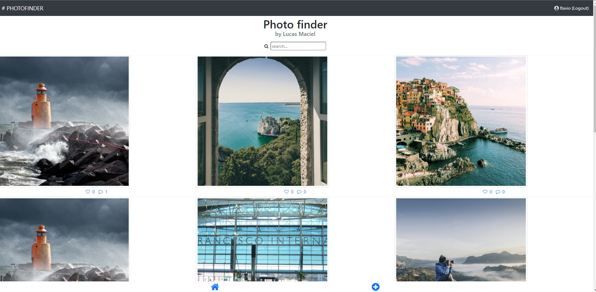
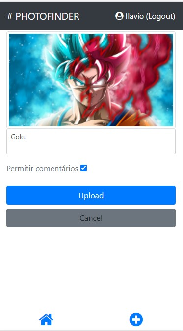

## PHOTOFINGER

Ferramentas utilizadas
- Front - Angular/typescript
- Backend - Node/Js 

## Para rodar o backend da aplicação
(Necessário ter o node v12.20.2 instalado)

* Dentro da pasta api, rodar os comandos;

> npm install

> npm run start (por padrão rodando na porta 3000)

## Para rodar o front end 
(Necessário ter o node v12.20.2 instalado)

* Dentro da pasta alurapic, rodar os comandos;

> npm install

> ng serve --open (por padräo rodando na porta 4200)

## Desktop

## Mobile

